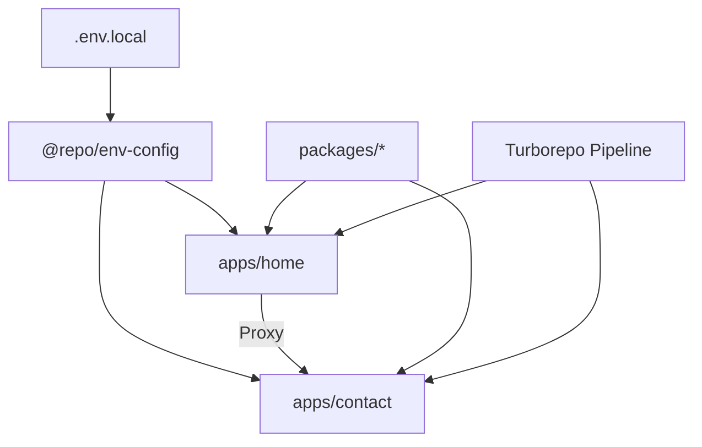

# 🦉 RightOwl Monorepo + Micro-frontend

> A high-performance Turborepo + Next.js monorepo powered by Bun.
> Build fast, scale easy, share everything.

## 📚 Table of Contents

- [📁 Project Structure](#-project-structure)
- [⚙️ Applications](#️-applications)
- [📦 Shared Packages](#-shared-packages)
- [🚀 Getting Started](#-getting-started)
- [🌱 Environment Variables](#-environment-variables)
- [🧪 Development](#-development)
- [🧱 Build](#-build)
- [🧹 Linting & Check](#-linting--check)
- [🏗️ Architecture Diagram](#️-architecture-diagram-mermaid)
- [🎞️ Workflow GIF](#️-workflow-gif)
- [🌐 Deployment](#-deployment)
- [🛠 Troubleshooting](#-troubleshooting)
- [🎨 Theme Dark/Light](#-theme-darklight)
- [📄 License](#-license)

#


## 💎 Core Concepts

- [Turborepo](https://turborepo.org/)
- [Multi-Zones | Next.js](https://nextjs.org/docs/pages/guides/multi-zones)

## 📁 Project Structure

```text
rightowl/
├── apps/
│   ├── contact/          # Next.js App (Port 3001)
│   └── home/             # Next.js App (Port 3000)
├── packages/
│   ├── env-config/          # Shared env loader
│   ├── eslint-config/       # Shared ESLint configs
│   ├── tailwind-config/     # Shared Tailwind v4 configs
│   ├── typescript-config/   # Shared tsconfig presets
│   └── ui/                  # Shared React UI Library
├── .env.local
├── turbo.json
└── package.json
```

## ⚙️ Applications

### 🇻🇳 `apps/home`

**Main website**

- Next.js App (Port 3000)
- Proxies traffic to contact app

### 🛂 `apps/contact`

**Visa application flow**

- Next.js App (Port 3001)
- Accessed under: `/contact`

## 📦 Shared Packages

| Package                   | Description                          |
| :------------------------ | :----------------------------------- |
| `@repo/ui`                | Shared React UI components           |
| `@repo/env-config`        | Loads root `.env.local` for all apps |
| `@repo/eslint-config`     | Shared ESLint base                   |
| `@repo/typescript-config` | Shared tsconfig                      |
| `@repo/tailwind-config`   | Tailwind v4 centralized config       |

## 🚀 Getting Started

1. **Clone repo**

   ```bash
   git clone https://github.com/khoidh24/rightowl.git
   cd rightowl
   ```

2. **Install dependencies (via Bun)**
   ```bash
   bun install
   ```

## 🌱 Environment Variables

Create root `.env.local`:

```env
NEXT_PUBLIC_CONTACT_DOMAIN="http://localhost:3001"
NEXT_PUBLIC_HOME_DOMAIN="http://localhost:3000"
```

> Apps automatically load these via `@repo/env-config`.

## 🧪 Development

Run all apps at once:

```bash
bun run dev
```

- **Home**: [http://localhost:3000](http://localhost:3000)
- **Contact**: [http://localhost:3001](http://localhost:3001)

## 🧱 Build

**Build everything:**

```bash
bun run build
```

**Build a single app:**

```bash
bun run build --filter=home
```

## 🧹 Linting & Check

```bash
bun run lint
bun run check-types
```

## 🏗️ Architecture Diagram (Mermaid)



## 🎞️ Workflow GIF

> 👉 Replace the placeholder below with your GIF:
> `/docs/workflow.gif`

## 🌐 Deployment

### Vercel (Recommended)

Each app = 1 Vercel Project.

| App         | Root Directory |
| :---------- | :------------- |
| **home**    | `apps/home`    |
| **contact** | `apps/contact` |

**Add environment variables:**

- `NEXT_PUBLIC_APPLY_VISA_DOMAIN="https://contact.vercel.app"`
- `NEXT_PUBLIC_VIETNAM_DOMAIN="https://home.vercel.app"`

**Turbo Ignore**

```bash
npx turbo-ignore
```

### AWS EC2 / VPS + PM2

**`ecosystem.config.js`**:

```javascript
module.exports = {
  apps: [
    {
      name: 'home',
      script: 'bun',
      args: 'run start',
      cwd: './apps/home',
      env: { PORT: 3000, NODE_ENV: 'production' },
    },
    {
      name: 'contact',
      script: 'bun',
      args: 'run start',
      cwd: './apps/contact',
      env: { PORT: 3001, NODE_ENV: 'production' },
    },
  ],
};
```

**Start apps:**

```bash
pm2 start ecosystem.config.js
pm2 save
```

## 🛠 Troubleshooting

### ❌ Env not loading?

- ✔ Place `.env.local` in root
- ✔ Ensure `import "@repo/env-config"` exists in `next.config.js`

### ❌ Rewrite/Proxy broken?

- ✔ Env domain must include protocol:

| Correct                 | Incorrect        |
| :---------------------- | :--------------- |
| `http://localhost:3000` | `localhost:3000` |

## 📄 License

MIT © RightOwl Team
